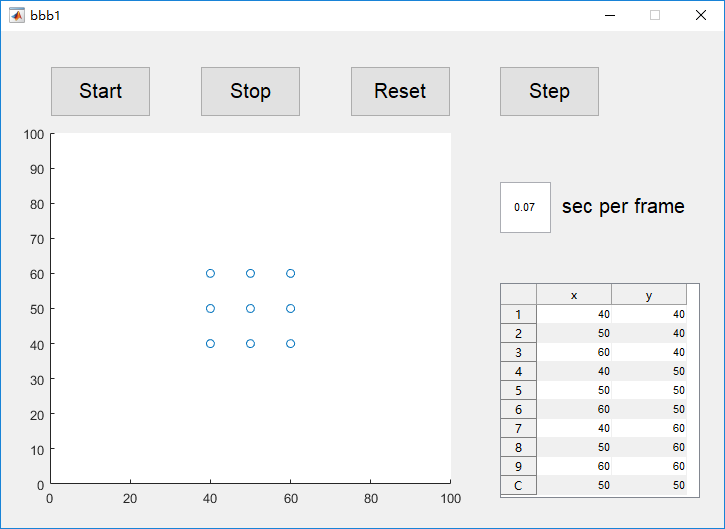
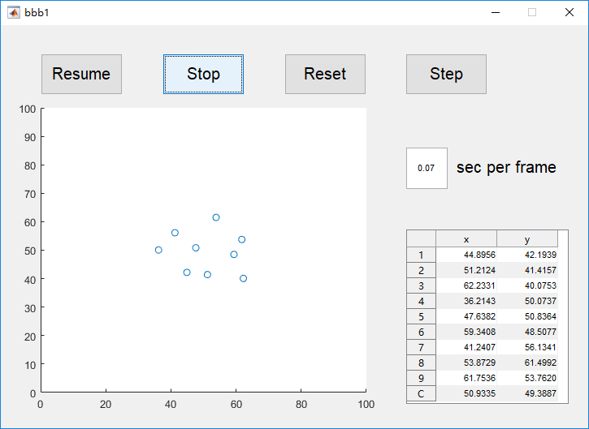

# bubble3C
a MATLAB GUI that simulates the cluster activity of insects in a plamar space.

We let each bubble move randomly in a small range constrained by several simple rules:

- Not be too close to other bubbles.
- Not be too far from the nearest bubble.
- Not be too far away from the group.  
- Not be too close to the boundary.

So they do not collide or separate, nor will they become sub-groups.

## Running the example
1. Put `bbb1.fig`, `bbb1.m`, `locatexyC.m` and `seekm.m` in the same directory.

2. Run `bbb1.m` in MATLAB.  

3. Use the pushbuttons on the graphic interface. 

Set the number in the editable text box to change the frame rate.

 

 
